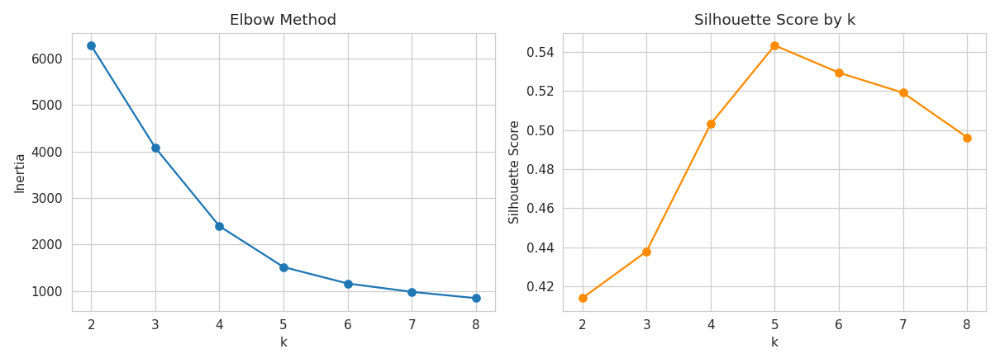
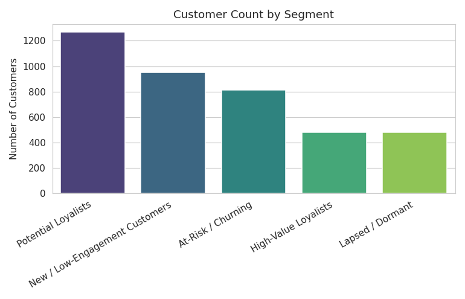
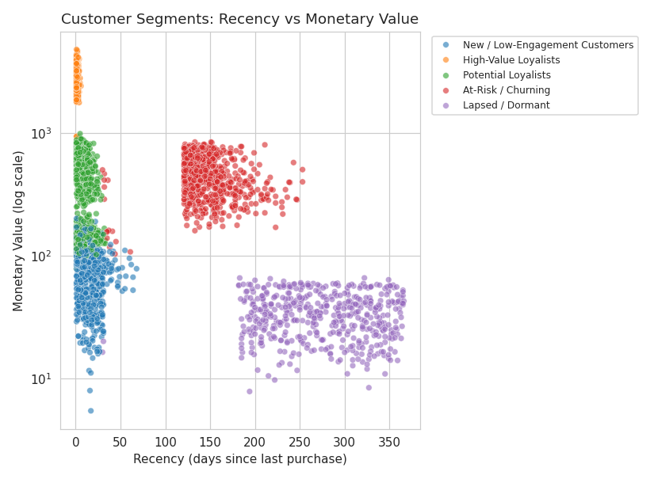
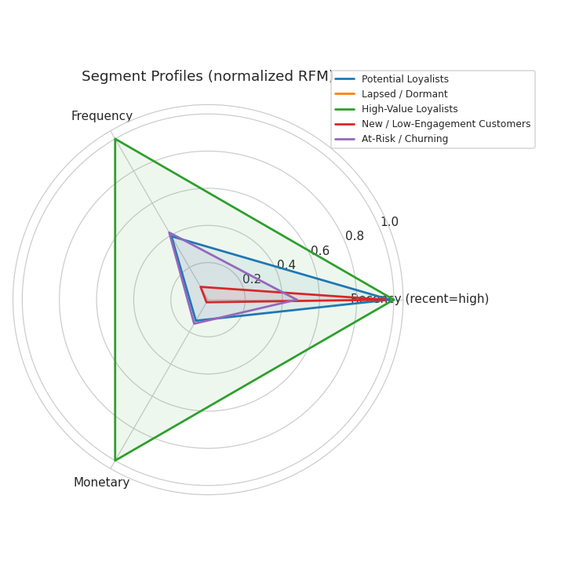

# 🛍️ Customer Segmentation for Targeted Marketing
### RFM Analysis + Unsupervised Clustering (K-Means, compared against DBSCAN)

> Segmented an e-commerce customer base into actionable behavioral groups using
> RFM (Recency, Frequency, Monetary) analysis and clustering, enabling targeted
> retention campaigns and an estimated **£58,700–£78,300 in recoverable revenue**
> from a single at-risk segment representing 20.4% of the customer base.

---

## 1. Business Problem

Retail and e-commerce businesses treat every customer the same way in mass marketing
campaigns, wasting spend on customers who won't respond and under-investing in
high-value customers who are quietly drifting away. This project answers:

> *"Which customers should we target, with what message, and what's the revenue
> opportunity in doing so?"*

## 2. Approach

| Step | What was done |
|---|---|
| **Data cleaning** | Removed cancelled orders, guest checkouts (missing Customer ID), invalid rows |
| **Feature engineering** | Computed RFM (Recency, Frequency, Monetary) per customer |
| **Preprocessing** | Log-transform (fixes heavy right-skew) + standardization |
| **Model selection** | Elbow Method + Silhouette Score to choose optimal *k* |
| **Clustering** | K-Means (primary), compared against DBSCAN |
| **Business translation** | Named each cluster, mapped to a concrete marketing action |
| **Impact estimate** | Quantified recoverable revenue from the At-Risk segment |
| **Deployment** | Interactive Streamlit dashboard + single-customer scoring tool |

## 3. Dataset

This project uses a **synthetic e-commerce transaction dataset** (`data/generate_data.py`)
that mirrors the schema of the well-known UCI *Online Retail II* dataset
(`Invoice, StockCode, Description, Quantity, InvoiceDate, Price, Customer ID, Country`).

**Why synthetic?** It makes the entire project reproducible end-to-end with zero
manual downloads — anyone can clone this repo and run it immediately. The generator
builds in six realistic customer behavior archetypes (loyal high-value, at-risk,
new, bargain hunters, etc.) so the clustering step has genuine structure to discover,
just like it would on real retail data.

**Want to use the real dataset instead?**
1. Download *Online Retail II* from [UCI](https://archive.ics.uci.edu/dataset/502/online+retail+ii) or Kaggle.
2. Save it as `data/online_retail_II.xlsx`.
3. In `notebook/analysis_core.py`, change `load_and_clean()` to read with `pd.read_excel()` instead of `pd.read_csv()`.

Everything downstream (RFM logic, clustering, naming, dashboard) works unchanged.

## 4. Results

- **~4,000 customers** analyzed across ~100K cleaned transaction line items.
- Optimal cluster count selected as **k = 5** via silhouette score (silhouette ≈ **0.54**, indicating well-separated clusters).
- **K-Means outperformed DBSCAN** for this use case — DBSCAN collapsed the data into far fewer, less business-actionable groups, while K-Means produced clusters that map cleanly onto recognizable customer types. See notebook Section 5 for the full comparison and reasoning.

### Segments discovered

| Segment | Description | Recommended Action |
|---|---|---|
| **High-Value Loyalists** | Recent, frequent, high spend | VIP perks, early access, referral incentives |
| **Potential Loyalists** | Recent, moderately engaged | Loyalty program invite, cross-sell |
| **New / Low-Engagement Customers** | Recent but few orders | Onboarding series, welcome discount |
| **At-Risk / Churning** | Was active, now going quiet | Win-back campaign, personalized discount |
| **Lapsed / Dormant** | Long inactive, low historical value | Reactivation campaign or deprioritize spend |

*(Exact counts and RFM averages per segment are in `outputs/cluster_summary.csv`, generated fresh each run.)*

### Business impact

- **20.4%** of the customer base falls into the **At-Risk / Churning** segment.
- That segment represents **£391,526** in historical spend.
- Assuming a conservative **15–20% win-back conversion rate** (industry-typical range for targeted re-engagement campaigns), a win-back campaign could recover an estimated **£58,700 – £78,300** in revenue.

*(This is a transparent, assumption-based estimate — the assumption is stated explicitly in `outputs/business_impact.json` so it can be defended or adjusted in an interview.)*

## 5. Visualizations

| | |
|---|---|
|  |  |
|  |  |

## 6. Project Structure

```
customer-segmentation-project/
├── data/
│   ├── generate_data.py           # Synthetic dataset generator
│   └── online_retail_synthetic.csv (generated)
├── notebook/
│   ├── analysis_core.py           # Full pipeline as reusable functions
│   └── customer_segmentation_analysis.ipynb  # Full walkthrough notebook (pre-run)
├── app/
│   └── streamlit_app.py           # Interactive dashboard + customer scoring tool
├── outputs/
│   ├── rfm_clusters.csv           # Per-customer RFM + segment assignment
│   ├── cluster_summary.csv        # Segment profiles + recommended actions
│   ├── business_impact.json       # Revenue impact estimate
│   ├── algorithm_comparison.json  # K-Means vs DBSCAN comparison
│   └── plots/                     # All generated charts
├── requirements.txt
└── README.md
```

## 7. How to Run

```bash
# 1. Clone and install dependencies
git clone <your-repo-url>
cd customer-segmentation-project
pip install -r requirements.txt

# 2. Generate the dataset
cd data
python generate_data.py
cd ..

# 3. Run the full analysis (produces outputs/ and outputs/plots/)
cd notebook
python analysis_core.py
cd ..

# 4. (Optional) Explore step-by-step in Jupyter
jupyter notebook notebook/customer_segmentation_analysis.ipynb

# 5. Launch the interactive dashboard
streamlit run app/streamlit_app.py
```

## 8. Tech Stack

`Python` · `pandas` · `NumPy` · `scikit-learn` (K-Means, DBSCAN, silhouette score) · `matplotlib` / `seaborn` · `Plotly` · `Streamlit` · `Jupyter`

## 9. Key Talking Points for Interviews

- **Why log-transform before scaling?** RFM data is heavily right-skewed (a few customers spend far more than most); log-transform pulls in outliers so Euclidean-distance-based K-Means isn't dominated by a handful of extreme spenders.
- **Why K-Means over DBSCAN here?** DBSCAN is better suited to data with well-separated, arbitrary-shaped, variable-density clusters. RFM segments tend to blend into each other along a continuum, which favors K-Means' centroid-based partitioning — confirmed empirically by comparing silhouette scores.
- **How was *k* chosen?** Combined the Elbow Method (diminishing returns in inertia) with the Silhouette Score (cluster separation/cohesion) rather than picking an arbitrary number.
- **How is this actually useful to a business?** Every cluster is translated into a named segment + a specific action + a quantified revenue opportunity — not left as an abstract "Cluster 3."
- **What would you do differently in production?** Persist the trained scaler + model with `joblib`, refresh segments on a schedule as new transactions arrive, and A/B test the recommended actions to validate the win-back conversion assumption against real outcomes.

---

*This project was built as part of a Data Scientist (ML) role portfolio.*
